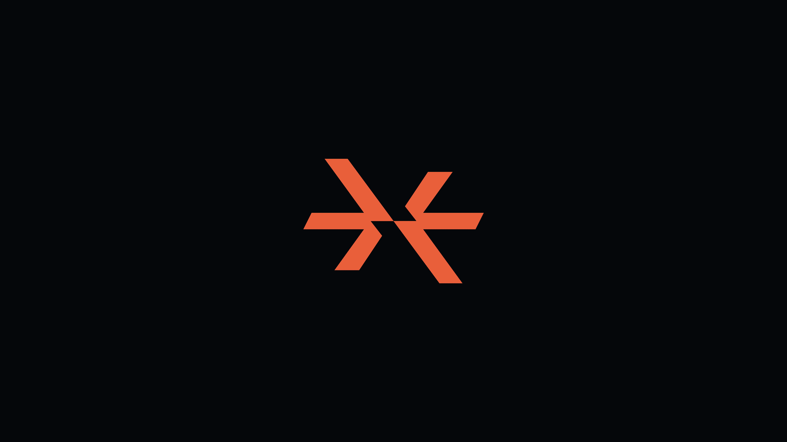
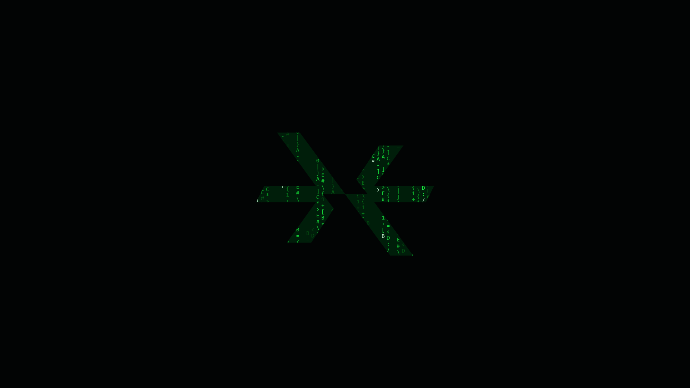

# Steerix Motion Gallery

Four auto-playing Steerix logo motion samples generated from vector coordinates and equations—without transforming source image frames.

Live gallery: <https://steerix-home.github.io/steerix-motion-gallery/>

<table>
  <tr>
    <td width="50%"></td>
    <td width="50%"></td>
  </tr>
  <tr>
    <td align="center"><strong>Motion 1 · Diagonal slide</strong></td>
    <td align="center"><strong>Motion 2 · Dock &amp; rotate</strong></td>
  </tr>
  <tr>
    <td width="50%"></td>
    <td width="50%"></td>
  </tr>
  <tr>
    <td align="center"><strong>Motion 2 · Random colors</strong></td>
    <td align="center"><strong>Motion 2 · Code rain</strong></td>
  </tr>
</table>

## Contents

- `assets/gifs/`: four final 60fps GIF files
- `src/steerix-loader.js`: dependency-free Web Component
- `src/export_animation.py`: base Motion 1 and Motion 2 renderer
- `src/export_motion2_fullhd_sample.py`: Full HD random-color renderer
- `src/export_motion2_code_rain_sample.py`: Full HD procedural code-rain renderer
- `src/logo.png`: original reference logo

## Regenerate

Requirements:

- Python 3.10+
- Pillow
- ffmpeg

```bash
python src/export_animation.py
python src/export_motion2_fullhd_sample.py
python src/export_motion2_code_rain_sample.py
```

The GitHub Pages gallery uses a fixed `16 / 9` viewport, `object-fit: cover`, and per-source zoom normalization so every animation occupies a consistent responsive card regardless of its source dimensions or aspect ratio.
